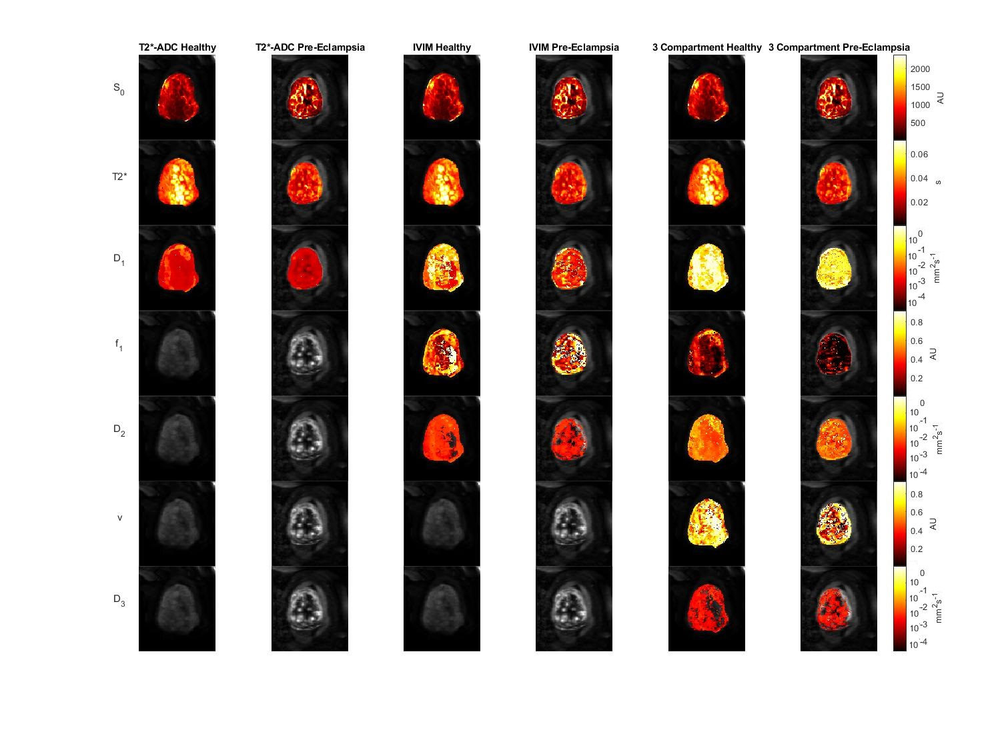

# Mapping multi-contrast microstructural MRI of the placenta

Project to map multi compartment models to MRI scans of a healthy and pre-eclampsia placenta.
These scans varied the b and T2* parameters to allow modelling of the variation of fluid speed
and oxygenation. This is especially helpful with regard to the placenta due to it's multiple
compartments

A number of models were implemented including IVIM, T2*-ADC, Continuum and 3 Compartment

Qualaitive and quantative difference were found between the scans using these models

See report.pdf for full details

## To Run 

Data access granted via Dr Paddy Slator(https://iris.ucl.ac.uk/iris/browse/profile?upi=PJSLA44)

Add as a data folder

Then run Main.mlx script

Example output shown in Main.pdf
